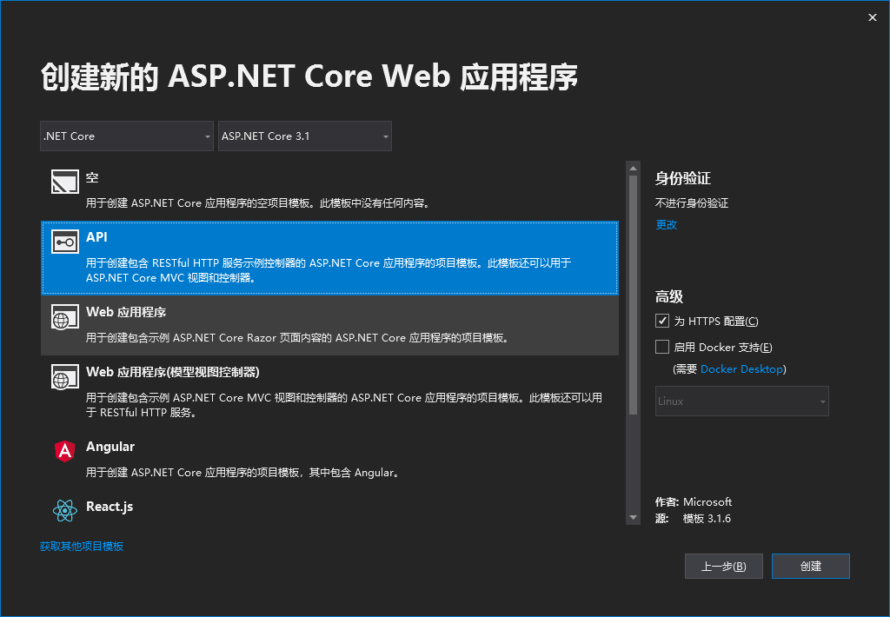
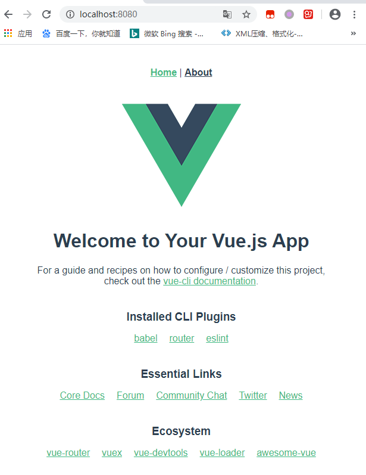
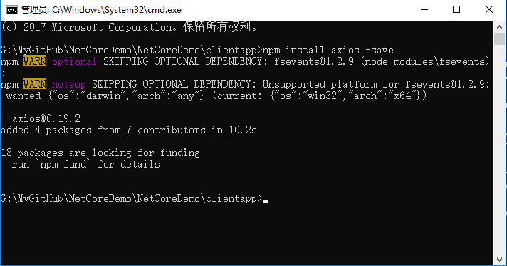

# .NetCore前后端分离项目搭建
## 一、创建基础项目

1. 创建一个Asp .Net Core WebAPI 项目



2. 进入项目的根目录下，使用 `cmd` 命令，通过 `vuecli` 创建前端项目==clientapp==
```
vue create clientapp
```

3. 在Nuget管理页面中安装 `VueCliMiddleware`，对照[github](https://github.com/EEParker/aspnetcore-vueclimiddleware)上的用法进行配置   
**Startup.cs**关键代码如下：
```
public void ConfigureServices(IServiceCollection services)
{
    services.AddControllers();
    services.AddSpaStaticFiles(option => option.RootPath = "clientapp/dist");
}

public void Configure(IApplicationBuilder app, IWebHostEnvironment env)
{
    if (env.IsDevelopment())
    {
        app.UseDeveloperExceptionPage();
    }
    app.UseSpaStaticFiles();

    app.UseHttpsRedirection();

    app.UseRouting();

    app.UseAuthorization();

    app.UseEndpoints(endpoints =>
    {
        endpoints.MapControllerRoute(
            name:"default",
            pattern:"{controller}/{action}/{id?}"
            );
        endpoints.MapToVueCliProxy(
            "{*path}",
            new SpaOptions { SourcePath = "ClientApp" },
            npmScript: (System.Diagnostics.Debugger.IsAttached) ? "serve" : null,
            regex: "Compiled successfully",
            forceKill: true
            );
    });
}
```

**.csproj**项目文件关键代码如下：
```
<ItemGroup>
		<PackageReference Include="VueCliMiddleware" Version="3.1.1" />
	</ItemGroup>

	<ItemGroup>
		<PackageReference Include="Microsoft.VisualStudio.Web.CodeGeneration.Design" Version="3.1.3" />
		<PackageReference Include="VueCliMiddleware" Version="3.1.1" />
	</ItemGroup>
	<ItemGroup>
		<!-- Don't publish the SPA source files, but do show them in the project files list -->
		<Content Remove="$(SpaRoot)**" />
		<None Include="$(SpaRoot)**" Exclude="$(SpaRoot)node_modules\**" />
	</ItemGroup>

	<Target Name="DebugEnsureNodeEnv" BeforeTargets="Build">
		<!-- Build Target:  Ensure Node.js is installed -->
		<Exec Command="node --version" ContinueOnError="true">
			<Output TaskParameter="ExitCode" PropertyName="ErrorCode" />
		</Exec>
		<Exec Command="yarn --version" ContinueOnError="true">
			<Output TaskParameter="ExitCode" PropertyName="ErrorCode" />
		</Exec>
		<Error Condition="'$(ErrorCode)' != '0'" Text="Node.js and npm are required to build and run this project. To continue, please install Node.js from https://nodejs.org/, and then restart your command prompt or IDE." />
	</Target>

	<Target Name="EnsureNodeModulesInstalled" BeforeTargets="Build" Inputs="package.json" Outputs="packages-lock.json" Condition="!Exists('$(SpaRoot)node_modules')">
		<!-- Build Target: Restore NPM packages using yarn -->
		<Message Importance="high" Text="Restoring dependencies using 'yarn'. This may take several minutes..." />
		<Exec WorkingDirectory="$(SpaRoot)" Command="yarn install" />
	</Target>

	<Target Name="PublishRunWebpack" AfterTargets="ComputeFilesToPublish">
		<!-- Build Target: Run webpack dist build -->
		<Message Importance="high" Text="Running yarn serve..." />
		<Exec WorkingDirectory="$(SpaRoot)" Command="yarn serve" />

		<!-- Include the newly-built files in the publish output -->
		<ItemGroup>
			<DistFiles Include="$(SpaRoot)dist\**" />
			<ResolvedFileToPublish Include="@(DistFiles->'%(FullPath)')" Exclude="@(ResolvedFileToPublish)">
				<RelativePath>%(DistFiles.Identity)</RelativePath>
				<CopyToPublishDirectory>PreserveNewest</CopyToPublishDirectory>
				<ExcludeFromSingleFile>True</ExcludeFromSingleFile>
			</ResolvedFileToPublish>
		</ItemGroup>
	</Target>
```
`.csproj`文件这边的代码在运行项目时不用单独去启用一个`cmd`来运行前端，方便直接运行项目。浏览器输入地址  http://localhost:8080



这样一个基础的 .Net Core前后端分离项目就建好了

## 二、项目扩展
1. 通过`axios`进行前后端数据交互
- `cmd` 进入 `clientapp` 目录下，安装 `axios`
运行命令 `vue add axios` 或 `npm install axios -save`


在`src`目录下
